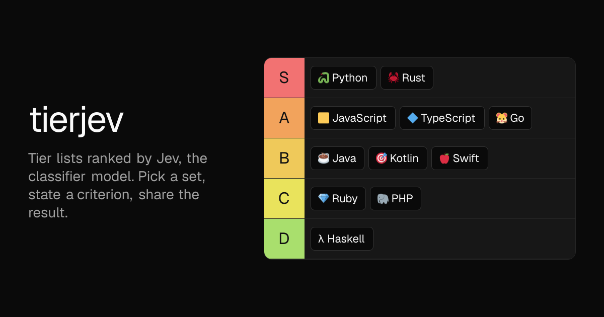

# tierjev

[](https://www.tierjev.com)

Tier lists ranked by [Jev](https://vercel.com/ai-gateway/models/jev), TypeSafe AI's classifier model. Pick a set, state a criterion, and Jev sorts it into S to F. Share the result as a link with its own social card.

**[tierjev.com](https://www.tierjev.com)** · example: [the 443 builds on Ship with Jev](https://www.tierjev.com/s/fQdNjTt6)

## How it works

1. **Pick or make a set.** Choose one of the bundled sets, generate a new one from a topic with DeepSeek, or paste your own list. Generated and pasted sets open in a preview where you can drop items and change their emoji or colour before creating them.
2. **Jev scores every item.** Each item becomes one score question against the criterion, sent to Jev through the AI Gateway. Long lists are scored in batches of 30, with the whole list shared as context so scores stay comparable.
3. **Scores become tiers.** Items are curved by rank into S to F, so every tier gets used and the best item always lands in S.
4. **Share it.** A share gets a short link, a static page served from the CDN, and a generated social image. Share pages never call Jev.

Tiles can also be dragged by hand, either after pressing Customize or while the hourly limit is reached.

## Stack

Next.js on Vercel, with Bun, Tailwind and Biome.

| Piece | Used for |
|---|---|
| Jev (`typesafe-ai/jev`) | Scoring items, picking colours, the safety check |
| DeepSeek V4.1 Flash | Generating sets from a topic |
| Upstash Redis | Caching, rate limits, shared lists |
| Vercel AI Gateway | One key for both models |

## Run locally

```bash
cp .env.example .env   # add AI_GATEWAY_API_KEY
bun install
bun dev
```

Redis is optional locally. Without it nothing is cached or rate limited. To use the production store, run `vercel env pull .env.local`.

`bun run check` runs Biome and the type checker.

## Deploy

1. Import the repo on Vercel.
2. Set `AI_GATEWAY_API_KEY`.
3. Add Upstash Redis from the Storage tab. It sets `KV_REST_API_URL` and `KV_REST_API_TOKEN`.

## Limits

| Endpoint | Per IP per hour | Cached for |
|---|---|---|
| Rank | 30 | 24 hours |
| Generate a set | 10 | 30 days |
| Pick colours | 20 | 30 days |
| Share | 20 | Forever |

Cache hits never reach Jev and do not count against the limit.

## Scripts

| Script | What it does |
|---|---|
| `scripts/generate-catalogue.ts` | Regenerates the bundled sets in `data/catalogue.json` |
| `scripts/scrape-shipwithjev.ts` | Scrapes the Ship with Jev catalogue into `data/shipwithjev.json` |
| `scripts/build-list.ts` | Turns a scraped catalogue into a ranked, shareable list |
| `scripts/icons.ts` | Renders the app icon at every size |

Scripts that call a model need the environment, for example `bun --env-file=.env.local scripts/build-list.ts --limit 443`.

## Layout

- `app/` holds pages and API routes. A route keeps the helpers that only it uses.
- `components/` holds the UI, with primitives in `components/ui/`.
- `lib/` holds code with two or more callers. Move a helper here when it gains a second caller, and back when it loses one.
- `bot/` holds the [@tierjev](https://x.com/tierjev) bot for X, which answers mentions with one option from the thread. See [bot/README.md](bot/README.md).
